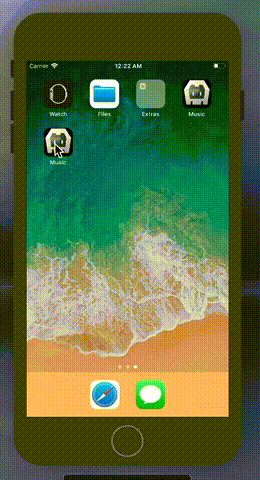
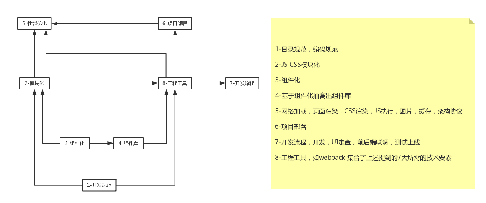
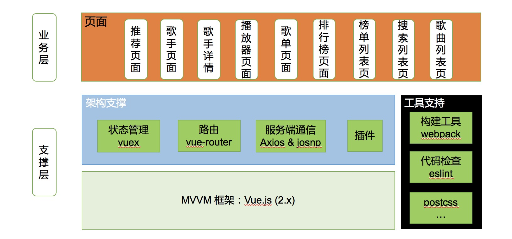
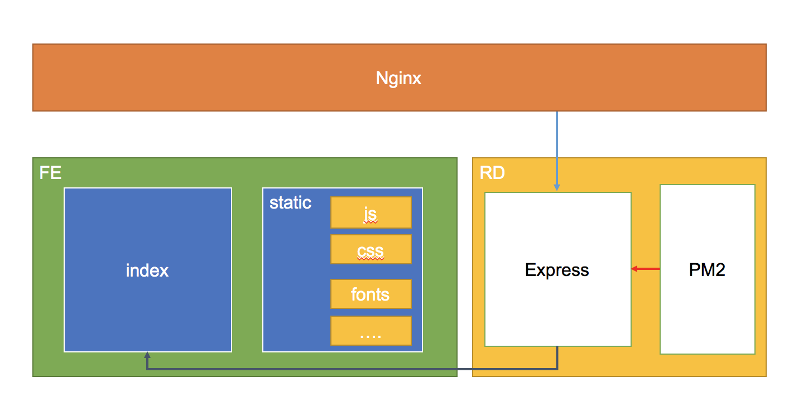

# QQ 音乐 WebApp

[](https://github.com/yxuchen/Music-Player/stargazers)
[](https://github.com/yxuchen/Music-Player/issues)
[](https://github.com/yxuchen/Music-Player/network)
[](https://github.com/yxuchen/Music-Player/blob/master/LICENSE)

## 介绍

该项目来源[HuangYi](https://github.com/ustbhuangyi), 之前写过他的[eleApp](https://github.com/yxuchen/eleApp),后来发现这个音乐 App，可惜未开源，但是有盗版开源，所以就有了这个仓库，后面回提到我的一些改进，总结。

之前接触过 React 和 Ng，所以上手Vue较快 ***但是为了防止自己的代码和老项目代码写的大头小易，养成不好习惯*** 就准备找个项目来学习，取长补短，同时也为了进一步熟悉理解Vue，所以就有了[eleApp](https://github.com/yxuchen/eleApp)和本项目

数据来源 QQ 音乐 JSONP，部分接口存在 http header 的限制所以用到了 node，托管于 VPS，PM2 部署，Nginx 代理，

### 扫一扫手机预览 (微信右上角使用浏览器打开)


[二维码地址](http://45.77.79.163/Music)

[***备用：项目演示地址***](https://yxuchen.github.io/Music-Player/music/#/recommend)

## 耗时

201710 - 201801

## 平台

* macOS High Sierra
* vscode

## 相关

* `Vue` @2.3.3, vue-router, vuex, axios
* `less` (不太习惯 stylus 所以我还是继续使用 less 了)
* `ES6` [standardjs 规范](https://github.com/standard/standard/blob/master/docs/RULES-zhcn.md)
* `Express`
* `jsonp` `axios` `promise`
* ~~~lib-flexbile~~~ `amfe-flexible@2.0`, `px2rem`

* `Vultr/heroku PM2 Nginx`

## 分支

* master
* [lib-flex](https://www.npmjs.com/package/amfe-flexible) 添加自适应布局 merge into master √
* [ssr](https://ssr.vuejs.org/en/) 服务端渲染实现 (待完成)
* [pre-render](https://github.com/chrisvfritz/prerender-spa-plugin) 预渲染实现 merge into master x

## 组件

* 基础组件：确认对话框，loading，进度条，搜索框，滚动组件
* 业务组件：歌单详情，播放内核，搜索页面，顶部导航，排行榜等组件
* 上拉刷新，函数防抖动搜索，消除点击延迟，异步路由

## 已完成部分

* [x] /recommand 推荐页：轮播图，推荐歌单列表
* [x] /singer 歌手页列表：歌手列表展示，左右联动，快速入口，类似通讯录
* [x] /singer/:id 歌手详情页：局部滚动，视差，播放音乐，音乐播放器有的功能都有
* [x] /rank/:id 排行页：同上
* [x] /search 搜索：搜索结果，搜索历史，热门搜索，结果播放
* [x] 播放列表页：当前播放队列
* [ ] ~~~用户中心页~~~

## 调试工具

* vConsole
* Charles
* [GIF录制](https://www.cockos.com/licecap/)

## 注意事项

* animation-play-state: paused ios 不支持[解决方案](https://codepen.io/HaoyCn/pen/BZZrLd)
* min-player [进度条实现](https://codepen.io/xgad/post/svg-radial-progress-meters)
* vue@2.5+  [ios 不能播放问题](https://github.com/DDFE/DDFE-blog/issues/24)

## 改进及优化

* QQ音乐 UI
* 适配优化
* 打包优化

### 打包

* 根据打包后的[分析报告](https://www.npmjs.com/package/webpack-bundle-analyzer)进行优化
* 处理 vendor，一般都是这部分体积大，相关类库一般不会变化，所以单独打包和其它文件一样加上 chunkhash 辨别文件是否变化，同时把 manifest 抽离出来，保证 manifest 变化不影响 vendor 变化导致缓存失效,这样默认就是 304，现在我通过 node 把他设置成强缓存了....外加 gzip
* 采用路由懒加载

### 适配

* 多端同构 webApp, Hybrid，采用 [amfe-flexible@2.x](https://www.npmjs.com/package/amfe-flexible) （相比以前的版本我更倾向于 2.x）配合 px2rem

* IOS 的 Safari 浏览器和微信 webview 兼容性和适配问题,此应用未调用设备 API

#### IOS 适配

* 打包成 ios [Hybrid](https://github.com/yxuchen/HybridApp) 系列模拟器正常 如 iphone7 Plus



* webApp && chrome


#### Andriod 适配

试了下腾讯的[weTest](http://wetest.qq.com/product/cloudphone?from=default_automail_new) 收费，没继续用

后来发现 GenyMotion，[夜神](https://www.yeshen.com/) 不准备测试

## 总结

* 201710 - 20180112 几个月的时间, 基本完成了我预期的开发，但是滚动库，歌词的处理等是原作者开源项目的，我在这个项目学到的东西主要是学习好的编程风格，习惯，更好的理解 Vue 中的知识点，增加开发经验
* 有了本项目，[eleApp](https://github.com/yxuchen/eleApp)，和我工作中的 Vue 开发经验，以及[element ui](https://github.com/ElemeFE/element)部分源码的阅读，至此已经对 Vue 的使用及特性有了一定的理解，同时我也在阅读 Vue 的一些源代码去深入的理解 Vue，这样会更好的处理开发中遇到的问题
* 工程化8大要素



* 前端架构



* 上线




## 未来展望

PWA

## 本地预览

```bash
$ git clone https://github.com/yxuchen/Music-Player.git
$ cd Music-Player
$ yarn install
$ yarn run dev
```
